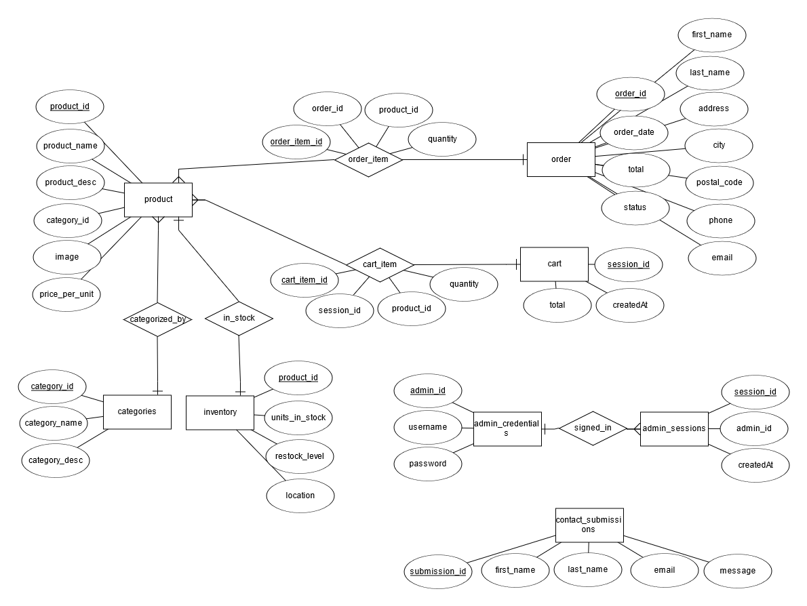
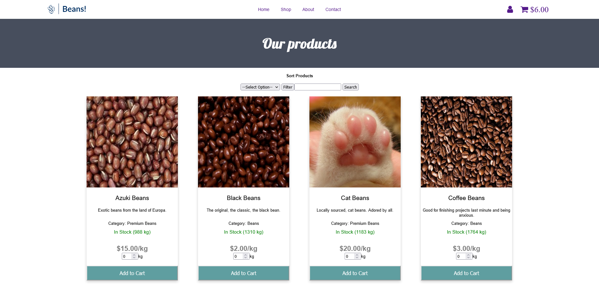
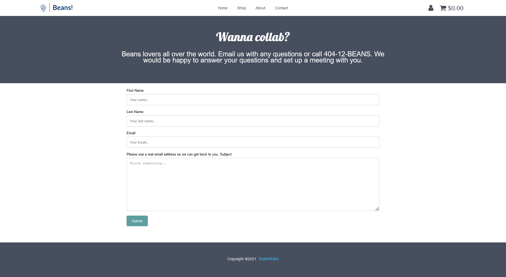

# TeamHobo_CSC4710_FinalProject

<h1 align="center">Beans!</h1>

<h2 align="center"><a  href="https://beans-website.herokuapp.com/">Live Demo</a></h2>

## Description

An online retail store website that specializes in **Beans!**. On the customer-side, the website has some of the most basic features of an online retail store such as adding items to cart from the list of products displayed under **Shop**, and placing an **order**. For managers, it provides an **Admin Dashboard** that shows overall the order history, updating order status, reading customer feedbacks.

## E-R Diagram:

## SQL DDL Command:

- Locate at **beans_ddl.txt**

## Data Generation Process

- Locate at **data generation\datagen.html**

## Data Generated from the above step.

- Locate at **data generation\*.csv**

## 5 Interesting queries

1. Gross Income Per Month/Year

   `SELECT SUM(total), EXTRACT(MONTH FROM order_date) AS month, EXTRACT(YEAR FROM order_date) AS year FROM orders WHERE STATUS = 'Completed' GROUP BY EXTRACT(YEAR_MONTH FROM order_date) ORDER BY order_date DESC`

2. Quantity of Beans (in kg) Sold By State

   `SELECT state, SUM(quantity) FROM orders NATURAL JOIN order_item WHERE STATUS = "Completed" GROUP BY state ORDER BY SUM(quantity) DESC;`

3. Gross Profit By State

   `SELECT state, SUM(total) FROM orders WHERE STATUS = "Completed" GROUP BY state ORDER BY SUM(total) DESC;`

4. Most Popular Bean Product By Quantity Sold

   `SELECT product_id, product_name, SUM(quantity) FROM order_item NATURAL JOIN product NATURAL JOIN orders WHERE status = "Completed" GROUP BY product_id ORDER BY SUM(quantity) DESC`

5. Gross Profit Generated By Each Bean Product

   `SELECT product_id, product_name, SUM(total_price) FROM( SELECT product_id, product_name, quantity*price_per_unit AS total_price FROM order_item NATURAL JOIN product NATURAL JOIN orders WHERE status = "Completed" ) AS x GROUP BY product_id ORDER BY SUM(total_price) desc;`

## Demo

- Google Drive Video Link: <a href ="https://drive.google.com/file/d/1OXO-umKUUsRDMBV0LOLpZGWFDBahw5Eo/view?usp=sharing">https://drive.google.com/file/d/1OXO-umKUUsRDMBV0LOLpZGWFDBahw5Eo/view?usp=sharing</a>

### Shopping:

- **Add** the item with specified quantity into Cart.
- **Update** the item (remove, update quantity) in the Cart.
- After finalizing your decision, go on and **Check Out**.
- Fill in and submit the Order Form, your order will be stored into the **Database**.

### Feedback/Contact:

- Fill in the **Contact** form and submit.
- Your message will be stored into into the **Database**.

### Admin Dashboard

#### Statistics

- Insights of the business.
- Display the Gross Income Per Month/Year, the Quantity of Beans (in kg) Sold By State, the Gross Profit By State, the Most Popular Bean Product By Quantity Sold, the Gross Profit Generated By Each Bean Product.

#### Manage Order

- All the orders are displayed in the lastest order.
- Click **Edit** to update the order status and see the order's detail.

#### Inventory Controller

- Display the inventory for each product.
- Click **Update** to update the stock quantity of each product.

#### Customer Feedback

- **Read** the customer's message sent from the website.

## About the project.

- This is the final project for our Database Systems class, the database is stored on ClearDB MySQL (Add-on on Herokuapp).
- **Note**: The website is far away from a fully-functional retail website. The project is more about our learning purpose on making an application with database connection.

### Author: Team Hobo

- Cuong Hoang (choang7)
- Chandler Bone (cbone1)
